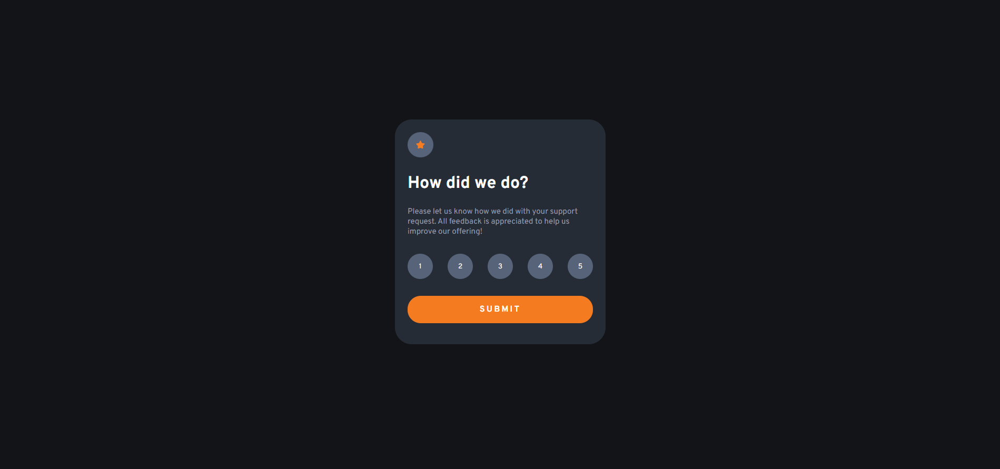

# Frontend Mentor - Interactive rating component main

This is a solution to the [Interactive rating component](https://www.frontendmentor.io/challenges/interactive-rating-component-koxpeBUmI/hub). 

## Table of contents

- [Overview](#overview)
  - [The challenge](https://www.frontendmentor.io/challenges/interactive-rating-component-koxpeBUmI/hub)
  - [Screenshot](./images/web.png)
- [Author](#author)

## Overview

### Screenshot

### Links

- Solution URL: [https://www.frontendmentor.io/solutions/responsive-social-link-profile-component-UMTWyJJlLl](https://www.frontendmentor.io/solutions/responsive-social-link-profile-component-UMTWyJJlLl)
- Live Site URL: [https://rugarcia25.github.io/social-links-profile-main/](https://rugarcia25.github.io/social-links-profile-main/)

### Built with

- Semantic HTML5 markup
- CSS custom properties
- Flexbox
- CSS Grid
- Mobile-first workflow

## Author

- Website - [Rubén Garcia](https://rgdev.netlify.app/)
- Frontend Mentor - [@rugarcia25](https://www.frontendmentor.io/profile/rugarcia25)
- Github - [@rugarcia25](https://github.com/rugarcia25)
